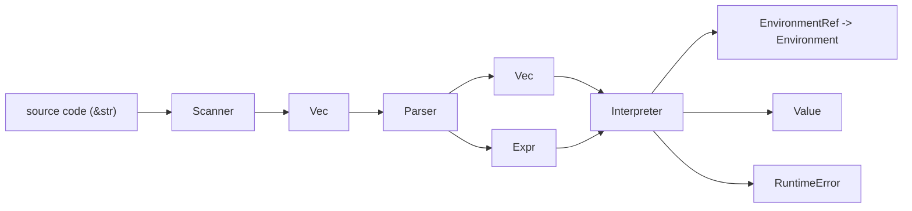
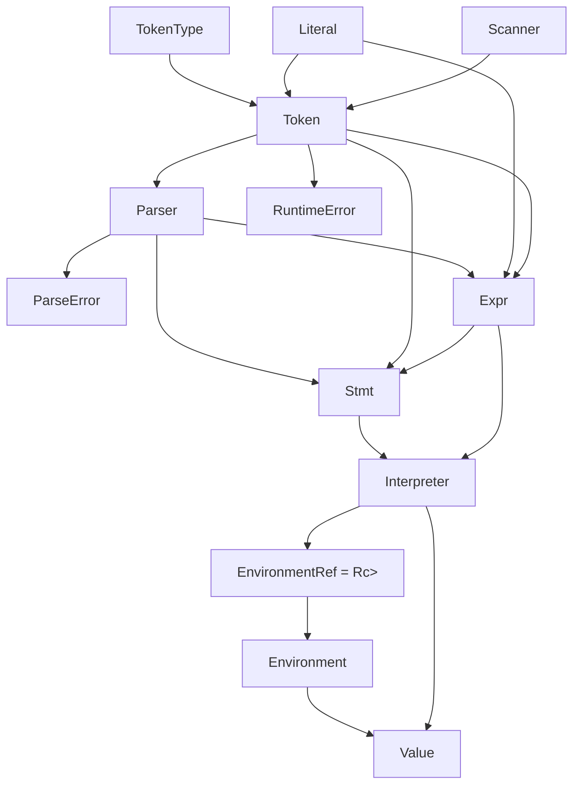

# Architecture

This file is a compact map of the current interpreter: the main data flow, the
core types, and the boundaries between frontend and runtime code.

## End-to-End Flow

The same pipeline is reused in both modes:

- script mode: source text is parsed into `Vec<Stmt>` and executed
- REPL bare-expression mode: source text is parsed into one `Expr` and
  evaluated directly

## Core Type Graph

## Type Roles

### Frontend

`TokenType`

- Enumerates lexical categories such as `Identifier`, `Number`, `If`, `And`,
  `LeftParen`, and `Eof`.
- The parser mainly makes decisions by looking at `TokenType`.

`Literal`

- Carries literal payloads recognized during scanning, such as string and
  number contents.
- Represents syntax-level literal data, not general runtime state.

`Token`

- Bundles `type_`, `lexeme`, optional `literal`, and `line`.
- Acts as the common unit passed from scanner to parser.
- Is also kept inside AST nodes and runtime errors so later stages still know
  which source token they came from.

`Scanner`

- Reads source text one character at a time.
- Produces a `Vec<Token>`.
- Owns the lexical rules of the language.

`ParseError`

- Lightweight marker type used inside the parser to unwind after a syntax
  failure.
- User-facing parse diagnostics are reported through `lox.rs`.

`Parser`

- Consumes `Vec<Token>` and produces either `Vec<Stmt>` or one `Expr`.
- Is split into a small root module plus `statements.rs` and
  `expressions.rs`, so statement parsing and expression precedence logic stay
  separated as the grammar grows.
- Encodes precedence and associativity through recursive-descent methods such
  as `assignment()`, `conditional()`, `logic_or()`, and `term()`.
- Desugars `for` loops into existing `Stmt::Block` and `Stmt::While` nodes
  instead of introducing a separate runtime-only statement form.
- Performs local error recovery with `synchronize()`.

`Expr`

- Expression AST nodes.
- Represents syntax that evaluates to a value: literals, variables, unary and
  binary operators, assignment, logical operators, and `?:`.

`Stmt`

- Statement AST nodes.
- Represents syntax that executes for effect: variable declarations, print
  statements, blocks, `if`, `while`, `break`, and expression statements.
- `for` does not have its own `Stmt` variant because the parser lowers it to
  more primitive statements during parsing.

### Runtime

`Value`

- Runtime value produced by evaluation.
- Current variants are `String`, `Number`, `Bool`, and `Nil`.
- This is the value type stored in environments and returned by expression
  evaluation.

`RuntimeError`

- Error raised during execution rather than parsing.
- Carries both a message and the relevant `Token` for source-location
  reporting.

`EnvironmentRef`

- Shared, mutable handle to an environment:
  `Rc<RefCell<Environment>>`.
- Lets the interpreter keep the current environment, while nested scopes still
  point to enclosing ones.

`Environment`

- Stores lexical bindings as `HashMap<String, Value>`.
- Optionally points to an enclosing environment to implement lexical scope and
  shadowing.
- Handles `define`, `assign`, and `get`.

`Interpreter`

- Walks the AST and turns syntax into behavior.
- Executes `Stmt` nodes and evaluates `Expr` nodes.
- Owns the current environment and implements the runtime semantics of the
  language.

## Important Boundaries

`Literal` vs `Value`

- `Literal` belongs to the frontend and describes literal payloads extracted
  from source code.
- `Value` belongs to the runtime and is what the interpreter actually computes
  with.

`Expr` vs `Stmt`

- `Expr` is evaluated for a result.
- `Stmt` is executed for side effects or control flow.

`Environment` vs `EnvironmentRef`

- `Environment` is the scope object itself.
- `EnvironmentRef` is the shared handle used to store and pass environments
  around safely in Rust.

`ParseError` vs `RuntimeError`

- `ParseError` means the source code could not be parsed.
- `RuntimeError` means the parsed program failed while executing.

## Coordination

`src/lox.rs` ties the pipeline together:

- `run_file()` handles script execution
- `run_prompt()` handles the REPL
- `run_tokens()` feeds parsed statements into the interpreter
- error flags and reporting helpers keep parse/runtime failures separated

The REPL reuses the same interpreter instance across inputs, so state such as
defined variables survives between prompt entries.
