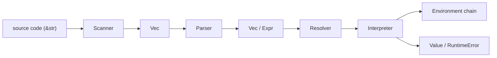

# oxidized-lox

A Rust implementation of the Lox language from *Crafting Interpreters*.

This repository currently contains the tree-walk interpreter path of Lox,
including classes, inheritance, and `super`, while a few optional chapter
challenges remain intentionally deferred.

## Overview

The codebase follows a simple frontend/runtime pipeline:



In the current source tree, the frontend-facing pieces now live under
`src/frontend/`, while `resolver`, `interpreter`, and `runtime` remain
separate top-level modules because they represent later semantic-analysis and
execution stages instead of raw parsing.

More detail is documented in [ARCHITECTURE.md](./ARCHITECTURE.md).

## Current Milestone

This repository currently captures the tree-walk interpreter milestone from
Chapters 4 through 13 of *Crafting Interpreters*, translated into Rust.

- implemented: scanning, parsing, AST construction, lexical resolution,
  functions, closures, classes, inheritance, `this`, and `super`
- intentionally deferred: selected chapter challenge features that would grow
  the language beyond the main chapter path
- not started yet: the bytecode VM from the second half of the book
- next planned milestone: a separate bytecode VM implementation that can live
  alongside this tree-walk interpreter

## Current Status

Implemented today:

- scanning for punctuation, operators, identifiers, keywords, strings, numbers,
  line comments, and block comments
- recursive-descent parsing for expressions and statements
- call expressions with runtime dispatch through a callable abstraction
- user-defined functions, local functions, closures, and `return`
- variables, assignment, block scope, `if`, `while`, `for`, `break`,
  logical `and` / `or`,
  and `?:`
- a resolver pass for lexical scope binding and static name checks such as
  local self-initializer errors, duplicate local declarations, and unused
  local variables
- class declarations, instance methods, bound methods, `this`, callable class
  objects, `init` initializers / constructors, and open instances with field
  storage plus property get/set
- single inheritance, inherited method lookup, and `super` method access with
  static resolver checks for invalid `super` uses
- a tree-walk interpreter with a small REPL
- one native callable, `clock()`

Later book stages still missing:

- optional chapter challenge features such as static methods, getters, and
  later extension challenges
- bytecode VM stages from later in the book

## Running

Build the project:

```bash
cargo build
```

Run a script:

```bash
cargo run -- examples/print_demo.lox
```

Try the block-scope example:

```bash
cargo run -- examples/block_scope_demo.lox
```

More example scripts live in `examples/`, including:

- `fibonacci_for_demo.lox` and `fibonacci_recursive_demo.lox` for iterative and recursive control flow
- `cons_list_demo.lox`, `merge_sort_list_demo.lox`, and `bst_demo.lox` for recursive data structures and algorithms
- `expr_tree_demo.lox` for symbolic expression trees, evaluation, and simplification
- `mandelbrot_ascii_demo.lox`, `rule30_demo.lox`, `sierpinski_carpet_demo.lox`, and `hilbert_curve_demo.lox` for ASCII pattern generation

For example:

```bash
cargo run -- examples/mandelbrot_ascii_demo.lox
```

Start the REPL:

```bash
cargo run
```

REPL notes:

- bare expressions are evaluated and printed automatically
- multi-line incomplete input is not buffered yet

## Development

Run the test suite:

```bash
cargo test
```

A minimal GitHub Actions workflow runs formatting, tests, and clippy on pushes
and pull requests.

Run lints with warnings treated as errors:

```bash
cargo clippy --all-targets --all-features -- -D warnings
```

Format the codebase:

```bash
cargo fmt
```

## Source Map

- `src/frontend.rs`: small aggregation module for frontend-only pieces
- `src/frontend/scanner.rs`: turns source text into `Vec<Token>`
- `src/frontend/parser.rs`: parser entry points, declarations, token helpers, and error recovery
- `src/frontend/parser/statements.rs`: statement parsing, including `if`, `while`, `for`, `break`, and `return`
- `src/frontend/parser/expressions.rs`: expression parsing and precedence handling, including call and property access syntax
- `src/frontend/expr.rs`: expression AST definitions
- `src/frontend/stmt.rs`: statement AST definitions, including function declarations and `return`
- `src/frontend/token.rs`: token and literal data types
- `src/resolver.rs`: resolver entry point and shared resolver state
- `src/resolver/expr.rs`: expression-side static scope resolution and lexical binding checks
- `src/resolver/stmt.rs`: statement-side static scope resolution, including class and function handling
- `src/resolver/scope.rs`: resolver scope-stack helpers, binding bookkeeping, and shared diagnostics
- `src/runtime.rs`: small re-export hub for runtime-facing types
- `src/runtime/value.rs`: runtime `Value` representation and conversions from literals
- `src/runtime/object.rs`: runtime callable/class/instance objects and method lookup
- `src/runtime/error.rs`: runtime error payloads
- `src/interpreter.rs`: interpreter entry points, environment handles, and resolver binding cache
- `src/interpreter/execute.rs`: statement execution and control-flow propagation
- `src/interpreter/evaluate.rs`: expression evaluation and runtime operator semantics
- `src/interpreter/callable.rs`: native/user-defined callable runtime objects
- `src/environment.rs`: lexical scope chain and variable storage
- `src/lox.rs`: top-level run modes, REPL flow, and error reporting
- `src/diagnostics.rs`: shared syntax/runtime diagnostic flags and reporting helpers
- `src/test_support.rs`: shared parser/resolver helpers for unit tests

## Key Distinctions

- `Literal` is syntax-level data carried through tokens and literal AST nodes.
- `Value` is the runtime value type produced by the interpreter.
- `Expr` nodes are evaluated for values.
- `Stmt` nodes are executed for side effects and control flow.

## Current Limitations

- The interpreter is still in the tree-walk stage and does not include the
  bytecode VM from later parts of the book.
- The REPL evaluates one input line at a time and does not yet buffer
  incomplete multi-line statements.
- Optional chapter challenge features such as static methods, getters, and the
  Chapter 13 extension challenges are still TODO.
- Runtime object cycles are not reclaimed yet because this interpreter does
  not implement a tracing garbage collector.

## Roadmap

Near-term goals:

- continue expanding parser and interpreter test coverage
- keep the code structure aligned with the book while documenting Rust-specific
  implementation choices
- decide whether to tackle selected chapter challenge features before moving
  on from the tree-walk interpreter

Longer-term goals:

- explore the later bytecode VM stages

## References

- Bob Nystrom, *Crafting Interpreters*
- This project currently follows the tree-walk interpreter path and adapts the
  implementation to Rust
- More internal notes and type/data-flow diagrams live in
  [ARCHITECTURE.md](./ARCHITECTURE.md)
