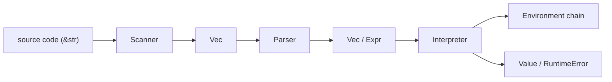

# oxidized-lox

A Rust implementation of the Lox language from *Crafting Interpreters*.

This repository currently contains a tree-walk interpreter for a growing subset
of Lox.

## Overview

The codebase follows a simple frontend/runtime pipeline:



More detail is documented in [ARCHITECTURE.md](./ARCHITECTURE.md).

## Current Status

Implemented today:

- scanning for punctuation, operators, identifiers, keywords, strings, numbers,
  line comments, and block comments
- recursive-descent parsing for expressions and statements
- call expressions with runtime dispatch through a callable abstraction
- user-defined function declarations and calls
- variables, assignment, block scope, `if`, `while`, `for`, `break`,
  logical `and` / `or`,
  and `?:`
- a tree-walk interpreter with a small REPL
- one native callable, `clock()`

Later book stages still missing:

- `return` statements and the rest of the function chapter
- classes
- resolver / bytecode VM stages from later in the book

## Running

Build the project:

```bash
cargo build
```

Run a script:

```bash
cargo run -- examples/print_demo.lox
```

Try the block-scope example:

```bash
cargo run -- examples/block_scope_demo.lox
```

Start the REPL:

```bash
cargo run
```

REPL notes:

- bare expressions are evaluated and printed automatically
- multi-line incomplete input is not buffered yet

## Development

Run the test suite:

```bash
cargo test
```

Run lints:

```bash
cargo clippy
```

Format the codebase:

```bash
cargo fmt
```

## Source Map

- `src/scanner.rs`: turns source text into `Vec<Token>`
- `src/parser.rs`: parser entry points, declarations, token helpers, and error recovery
- `src/parser/statements.rs`: statement parsing, including `if`, `while`, `for`, and `break`
- `src/parser/expressions.rs`: expression parsing and precedence handling, including call syntax
- `src/expr.rs`: expression AST definitions
- `src/stmt.rs`: statement AST definitions, including function declarations
- `src/interpreter.rs`: executes statements and evaluates expressions
- `src/environment.rs`: lexical scope chain and variable storage
- `src/lox.rs`: top-level run modes, REPL flow, and error reporting
- `src/token.rs`: token and literal data types

## Key Distinctions

- `Literal` is syntax-level data carried through tokens and literal AST nodes.
- `Value` is the runtime value type produced by the interpreter.
- `Expr` nodes are evaluated for values.
- `Stmt` nodes are executed for side effects and control flow.

## Current Limitations

- The interpreter is still in the tree-walk stage and does not include the
  resolver or bytecode VM from later parts of the book.
- The REPL evaluates one input line at a time and does not yet buffer
  incomplete multi-line statements.
- The language implementation is still a subset of full Lox and does not yet
  support `return`, classes, or the later resolver/VM stages.

## Roadmap

Near-term goals:

- add functions and the next features from the book
- finish the remaining function features such as `return`
- continue expanding parser and interpreter test coverage
- keep the code structure aligned with the book while documenting Rust-specific
  implementation choices

Longer-term goals:

- keep extending function support through closures and methods
- add classes and methods
- explore the resolver and later bytecode VM stages

## References

- Bob Nystrom, *Crafting Interpreters*
- This project currently follows the tree-walk interpreter path and adapts the
  implementation to Rust
- More internal notes and type/data-flow diagrams live in
  [ARCHITECTURE.md](./ARCHITECTURE.md)
